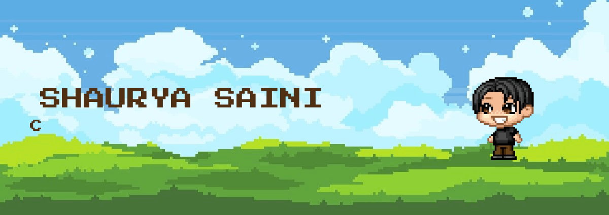
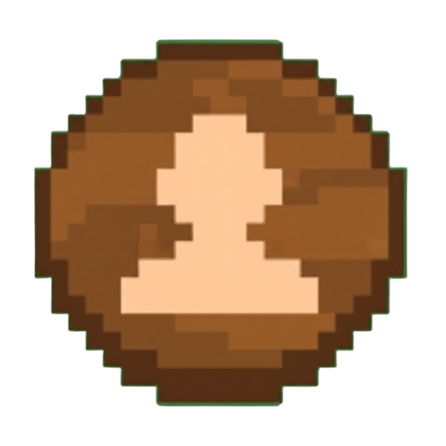

  

---
<table align="center">
  <tr>
    <td align="center"><a href="https://shaurya-saini.github.io/The-Master-Portfolio/"> Portfolio</a></td>
    <td align="center"><a href="medium.com/@shauryathemaster01"> Medium</a></td>
    <td align="center"><a href="https://github.com/Shaurya-Saini"> GitHub</a></td>
    <td align="center"><a href="https://www.linkedin.com/in/shaurya-saini-9b016228a/"> LinkedIn</a></td>
    <td align="center"><a href="mailto:shauryathemaster01@gmail.com"> Email</a></td>
  </tr>
</table>

---
 

  <!-- Main Stats Card -->
  
  <!-- Top Languages Card -->
  
  <!-- Streak Card -->
  

---

## Languages

  

## Frameworks, Tools & Platforms

  

